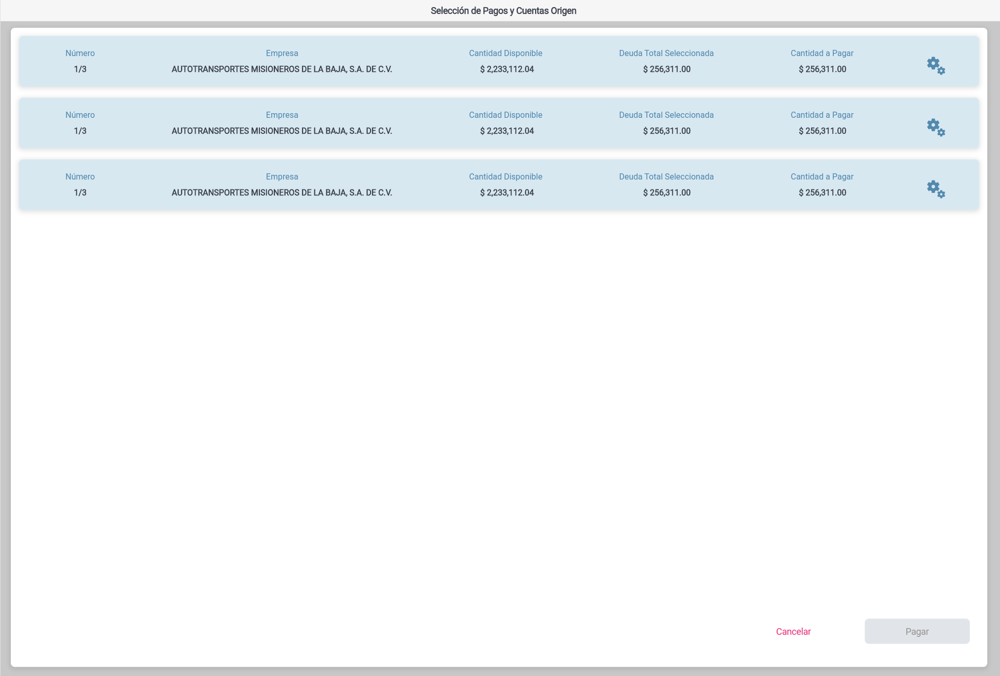
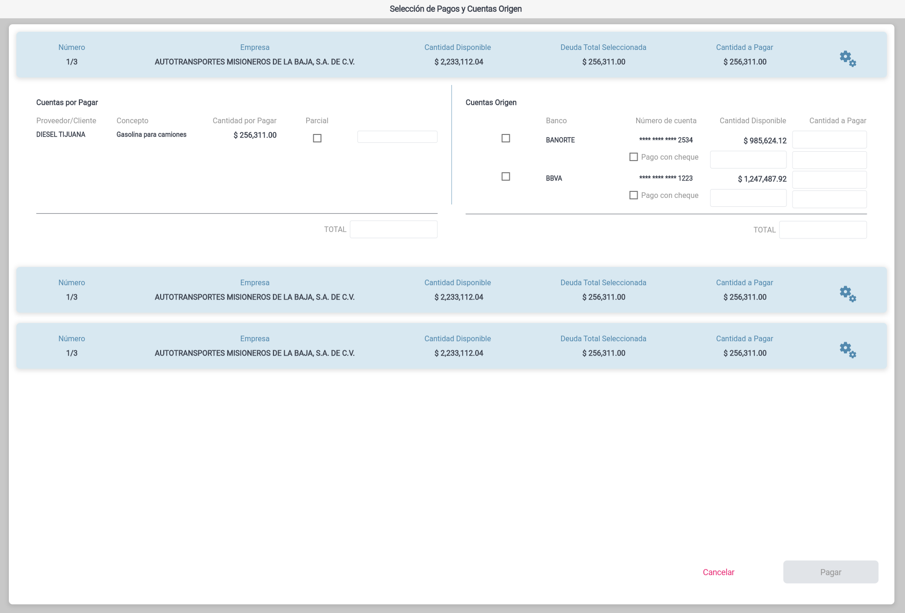
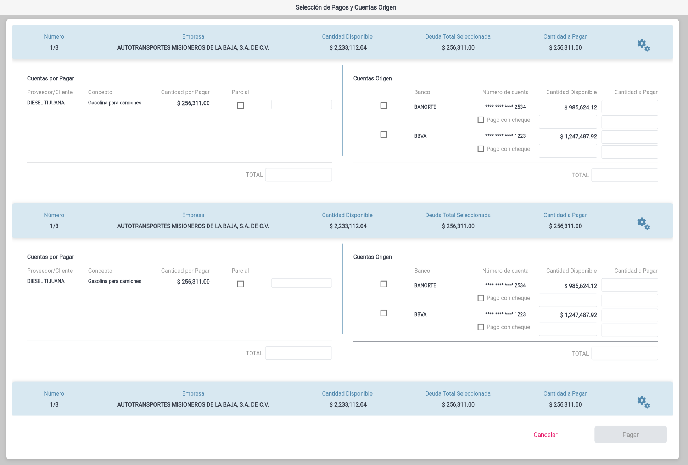

# Pagos y Cuentas

A personal expense management application built with Flutter. Manage your payments and accounts with an intuitive interface.

## Features

- View and manage accounts payable
- Track payment sources and amounts
- Organize expenses by vendor and concept

## Getting Started

This project uses Flutter 3.0+ and Material 3 design.

```sh
flutter pub get
flutter run
```

## Testing

```sh
flutter test
flutter analyze
```




